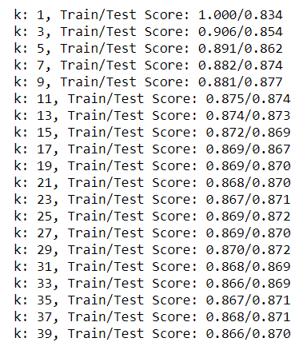
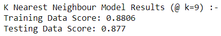

# Exoplanets-machine-learning-challenge
Over a period of nine years in deep space, the NASA Kepler space telescope has been out on a planet-hunting mission to discover hidden planets outside of our solar system. This project creates machine learning models capable of classifying candidate exoplanets from the raw dataset.

## Tools and Technologies used and required to run the project
* Python- 
    * Modules : SkLearn, Pandas, Matplotlib
*  Jupyter Notebook

## How to Run the Project

1. Download the csv file, and the jupyter notebook
2. Open Jupyter notebook and run all cells to view the result

## Obervations
Random Forest Model was the best model amongst the four with test data score of 90.73% 
However, there are a number of ways a accuracy in machine learning can be improved. Few of them are:-
* Models have a number of parameters that can be used for algorithm tuning
* Using statistical parameters, visualization, domain knowledge  for better feature selection 
* These models may not be the ideal ones for the given dataset, trying other models may give better outcome.

1. Random Forest

2. Logistic Regression

3. K-nearest

4. Support Vector 

## Steps involved in building the project
### I. Preprocess the Raw Data
1. Simple cleaning by drop NA
2. Performed feature selection calculating feature importance and selecting features with importance more than 3%.
3. Used `MinMaxScaler` to scale the numerical data.
4. Separated the data into training and testing data.

### II. Hyper Parameter Tuning
* Used `GridSearch` to tune model parameters.

### III. Traning and Testing
* Trained and tested 4 different models and checked their accuracy on the test data.

## Data Source
* [Exoplanet Data Source](https://www.kaggle.com/nasa/kepler-exoplanet-search-results)